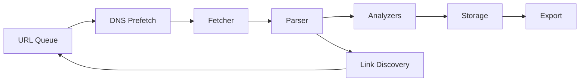

# crawlkit

[](https://github.com/WyattAu/crawlkit/actions)
[](LICENSE)
[](https://www.rust-lang.org/)
[](https://github.com/WyattAu/crawlkit)
[](https://github.com/WyattAu/crawlkit)
[](https://github.com/WyattAu/crawlkit)

Rust web crawler and SEO analysis toolkit. Async HTTP/2 fetching, an extensible analyzer registry, WASM plugins, supply-chain auditing, and zero Clippy warnings in the enforced workspace gate.

## Architecture



### Workspace Structure

```
crawlkit/
  crates/
    crawlkit/          # CLI binary
    crawlkit-api/      # REST API server (axum)
    crawlkit-engine/   # Core types, analyzers, storage, export
    crawlkit-plugin-sdk/ # Plugin development kit
  dashboard/           # React + Tailwind web dashboard
  web/                 # Astro + Starlight documentation site
  clients/             # Go, Node.js, Python client libraries
  docs/                # Architecture, roadmap, competitive analysis
  .github/workflows/   # CI/CD (format, clippy, test, audit, release)
  Cargo.toml           # Workspace root
```

## Quick Start

### Install

```bash
cargo install crawlkit
```

### From source

```bash
git clone https://github.com/WyattAu/crawlkit.git
cd crawlkit
cargo build --release
# binary: target/release/crawlkit
```

### Run

```bash
crawlkit crawl https://example.com --max-pages 50
crawlkit compare crawl1/ crawl2/ --output diff.json
crawlkit report crawl1/ --format html --output report.html
```

## CLI Reference

| Command | Description |
|---------|-------------|
| `crawlkit crawl` | Crawl a website and run analyzers |
| `crawlkit compare` | Diff two crawl snapshots |
| `crawlkit report` | Generate report from crawl data |
| `crawlkit schedule` | Manage recurring crawls on a crawlkit-api server (add/list/enable/disable/remove) |

| Option | Default | Description |
|--------|---------|-------------|
| `-u, --url <URL>` | -- | Target URL |
| `-m, --max-pages <N>` | 100 | Maximum pages |
| `-d, --delay <MS>` | 500 | Delay between requests (ms) |
| `-c, --concurrency <N>` | 4 | Concurrent fetchers |
| `-o, --output <DIR>` | `.` | Output directory |
| `-f, --format <FMT>` | `all` | Output: json, csv, sqlite, html, all |
| `--max-depth <N>` | -- | Maximum crawl depth |
| `--user-agent <STR>` | -- | Custom user agent |
| `--timeout <SECS>` | 30 | Request timeout (seconds) |
| `--no-robots` | -- | Ignore robots.txt |
| `--javascript` | -- | Enable JS rendering |

## Configuration

Create `crawlkit.toml` in the working directory:

```toml
[crawl]
seed_urls = ["https://example.com"]
max_pages = 200
max_depth = 10
max_redirect_hops = 20
max_concurrent_requests = 64
request_timeout_secs = 30
crawl_delay_default_ms = 1000
user_agent = "crawlkit/2.0.0"
respect_robots_txt = true

[crawl.scope]
allowed_domains = ["example.com"]
blocked_patterns = ["/wp-admin/*", "/api/*"]

[analyzers]
enabled = ["meta", "links", "security", "accessibility", "content", "ai", "wasm"]

[output]
formats = ["json", "sqlite", "html"]
output_dir = "./crawl-results"
```

## Analyzers

Analyzer and finding-code counts are **generated from the registry**, not
hand-maintained: see the `[counts]` table in
[docs/capabilities.toml](docs/capabilities.toml), which CI keeps in sync with
the live registry via the `manifest_drift_check` gate (ROADMAP Phase 0.1).
Census profile: `full` (all groups enabled) on a representative page.

| Category | Analyzers |
|----------|-----------|
| HTTP | HttpStatusAnalyzer, RedirectChainAnalyzer |
| SEO | CanonicalUrlValidator, HreflangValidator, SitemapAnalyzer, RobotsTxtAnalyzer, MetaTagAnalyzer, AdvancedCanonicalAnalyzer, SitemapCanonicalValidator, UrlFormatValidator |
| Content | ContentQualityAnalyzer, WordCountAnalyzer, EnhancedReadabilityAnalyzer, KeywordAnalyzer, EcommerceSignalsAnalyzer, InternationalSeoAnalyzer |
| Links | LinkAnalyzer |
| Images | ImageAnalyzer |
| Schema | StructuredDataValidator |
| Security | SecurityHeaderAnalyzer, SslCertificateValidator |
| Mobile | MobileFriendlinessChecker |
| Accessibility | AccessibilityAnalyzer (16 WCAG 2.1 AA checks) |
| Social | SocialMediaAnalyzer |
| Entity | EntityAnalyzer |
| AI | AiCrawlerAccessibilityAnalyzer, AiContentStructureAnalyzer, AiCitationEligibilityAnalyzer, AiAnswerBoxAnalyzer |
| WASM | WasmPatternAnalyzer |

## Performance

> All numbers measured on local hardware. See [benchmarks/measured-v5.1.0.md](docs/benchmarks/measured-v5.1.0.md) for methodology and load caveats.

| Metric | Value |
|--------|-------|
| Throughput (TestServer, 50–500 pages, conc=4) | 128.9–191.0 pages/sec |
| Binary size (release, LTO+strip) | 24.6 MiB |
| Startup time (median, N=50) | 4.1 ms |
| HTML parse (5 KB) | 594 µs |
| Full analyzer suite (registry) | 2.09 ms/page |
| PageRank (100 nodes, 20 iterations) | 912 µs |

Run benchmarks:

```bash
cargo bench
```

Covers: HTML parser, analyzer execution, registry lookup, queue operations, storage insert/query.

Run end-to-end throughput benchmark:

```bash
just bench-e2e
```

## Release verification

Release archives are checksummed and signed; the signature and the
signing key's public half ship as release assets.

```bash
# 1. Check every downloaded artifact (archives + SBOMs):
sha256sum -c checksums.txt

# 2. Authenticate the checksum manifest (imports the release public key
#    from the release assets on first use):
gpg --import release-key.pub.asc
gpg --verify checksums.txt.asc checksums.txt
```

The signing key fingerprint is pinned in `docs/RELEASE_ASSURANCE.md`;
if `gpg --verify` reports a key with a different fingerprint, stop.

## Security Model

- HTTP/2 with TLS via rustls (no OpenSSL dependency)
- `unsafe_code = "deny"` at workspace level; narrowly scoped unsafe FFI exists in ABI/plugin components and requires documented safety invariants
- robots.txt compliance by default
- Rate limiting with configurable delay
- Content Security Policy header scoring
- Supply chain audit via `cargo audit` and `cargo deny`
- API key redaction in list endpoints
- Argon2 password hashing with per-user salt
- OIDC support for SSO integration

## Quality Gates

Pre-commit hooks enforce:

1. `cargo fmt --check` -- formatting
2. `cargo clippy --workspace --all-targets -- -D warnings` -- lint
3. `cargo check --workspace` -- compilation
4. `cargo test --lib --workspace` -- unit tests
5. `cargo test --doc --workspace` -- doc tests
6. Integration tests (excl. playwright)
7. `cargo audit` -- security advisories
8. Hardcoded secret scan
9. Unsafe code without SAFETY comment
10. MSRV check (Rust 1.94.0)
11. Dead code detection

## Plugins

Signed WASM analyzers with a zero-infrastructure marketplace (v4.1.0+):

```bash
crawlkit plugin install title-length \
  --index https://raw.githubusercontent.com/WyattAu/crawlkit/main/plugins/index/plugin-index.toml
crawlkit plugin list
crawlkit plugin remove title-length
```

Artifacts are content-addressed (sha256) and ed25519-verified against the
built-in trust store BEFORE installation. Build your own:
[PLUGIN_ARCHITECTURE.md](PLUGIN_ARCHITECTURE.md) and
[docs/PLUGIN_DEVELOPMENT.md](docs/PLUGIN_DEVELOPMENT.md).

Installed plugins run automatically during every crawl (default roots:
`~/.crawlkit/plugins` + `$CRAWLKIT_PLUGIN_DIRS`; override with
`--plugins <dir>`). Plugin findings appear alongside built-in analyzer
results with `plugin:<category>` categories — and plugin failures never
abort a crawl.

## Documentation

| Document | Path |
|----------|------|
| Architecture | [docs/ARCHITECTURE.md](docs/ARCHITECTURE.md) |
| Roadmap | [docs/ROADMAP.md](docs/ROADMAP.md) |
| Product Strategy | [docs/PRODUCT_STRATEGY.md](docs/PRODUCT_STRATEGY.md) |
| Competitive Matrix (20 tools) | [docs/COMPETITIVE_MATRIX.md](docs/COMPETITIVE_MATRIX.md) |
| Integrations (GSC, CrUX, LLM) | [docs/INTEGRATIONS.md](docs/INTEGRATIONS.md) |
| Findings JSON Schema | [docs/schema/findings.schema.json](docs/schema/findings.schema.json) |
| ADR-001 | [docs/ADR-001-crawler-architecture.md](docs/ADR-001-crawler-architecture.md) |
| Benchmarks | [docs/benchmarks.md](docs/benchmarks.md) |
| Getting Started | [docs/tutorials/getting-started.md](docs/tutorials/getting-started.md) |
| Custom Analyzers | [docs/tutorials/custom-analyzers.md](docs/tutorials/custom-analyzers.md) |
| CI Integration | [docs/tutorials/ci-integration.md](docs/tutorials/ci-integration.md) |

## Contributing

See [CONTRIBUTING.md](CONTRIBUTING.md).

## License

Apache License 2.0. See [LICENSE](LICENSE).

*Version: 5.0.0 | Last reviewed: 2026-09-06*
